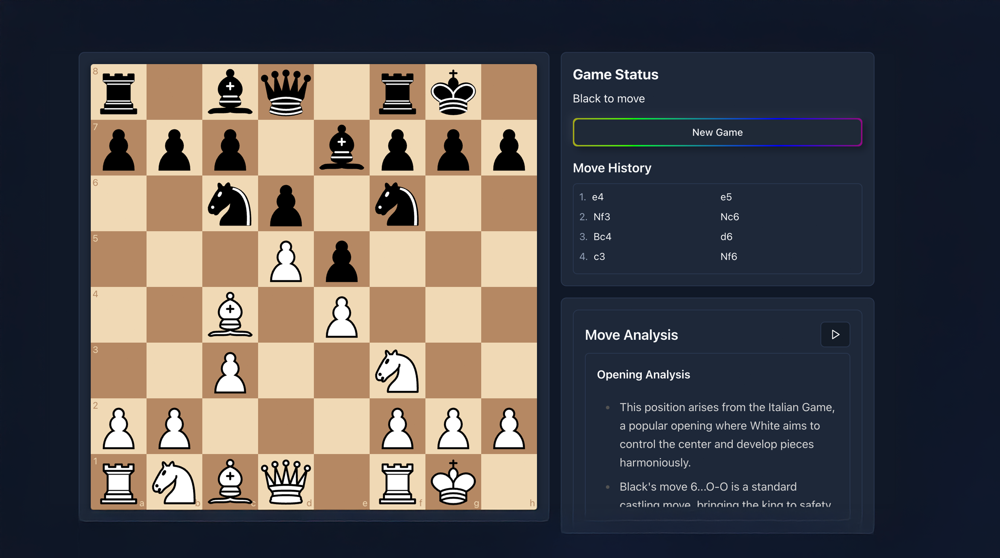
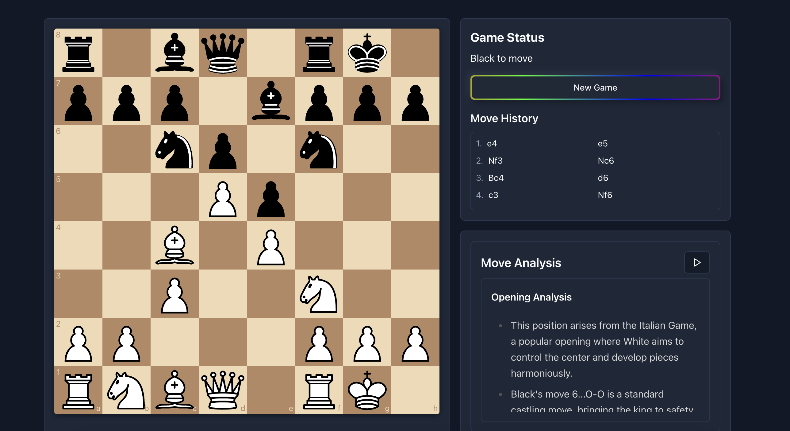
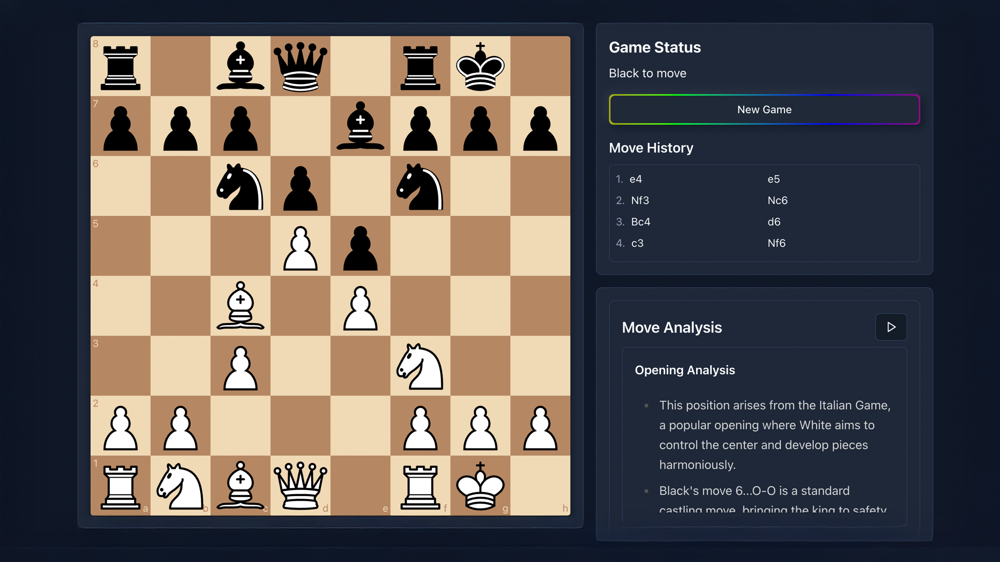

# ChessMind AI: Your Personal Chess Coach

ChessMind AI is a web application designed to help chess players of all levels improve their game. It provides real-time analysis of your moves, personalized feedback, and the ability to practice against an AI opponent that adapts to your skill level.

## Live Demo

[Link to live demo](https://chessmindai.vercel.app)

## Key Features

- **Real-time Move Analysis**: Get instant feedback on your moves, powered by GPT-3.5.
- **AI Opponent**: Play against a Stockfish-powered bot with adjustable difficulty levels.
- **Interactive Chessboard**: A smooth and responsive chessboard to play on.
- **Text-to-Speech Analysis**: Listen to the move analysis for a more immersive learning experience.
- **Authentication**: Secure user authentication with Clerk.
- **Move History and Navigation**: Review your game and navigate through moves.

## Screenshots

| Landing Page | Practice Page |
| :---: | :---: |
|  |  |
| **Move Analysis** |
|  |

## Tech Stack

- **Framework**: [Next.js](https://nextjs.org/)
- **Language**: [TypeScript](https://www.typescriptlang.org/)
- **Styling**: [Tailwind CSS](https://tailwindcss.com/)
- **UI Components**: [shadcn/ui](https://ui.shadcn.com/)
- **Authentication**: [Clerk](https://clerk.com/)
- **AI**: [OpenAI API](https://openai.com/docs) (GPT-3.5 for analysis, TTS for audio)
- **Chess Engine**: [Stockfish.js](https://github.com/official-stockfish/Stockfish)
- **Chess Logic**: [chess.js](https://github.com/jhlywa/chess.js)
- **Deployment**: [Vercel](https://vercel.com/)

## Getting Started

Follow these instructions to get a copy of the project up and running on your local machine for development and testing purposes.

### Prerequisites

- [Node.js](https://nodejs.org/en/) (v18 or later)
- [npm](https://www.npmjs.com/), [yarn](https://yarnpkg.com/), [pnpm](https://pnpm.io/), or [bun](https://bun.sh/)

### Installation

1.  **Clone the repository:**
    ```bash
    git clone https://github.com/your-username/chess-analyser.git
    cd chess-analyser
    ```

2.  **Install dependencies:**
    ```bash
    npm install
    # or
    yarn install
    # or
    pnpm install
    # or
    bun install
    ```

### Environment Variables

To run this project, you will need to add the following environment variables to a `.env.local` file in the root of your project.

```
OPENAI_API_KEY=your_openai_api_key

# Clerk Environment Variables
NEXT_PUBLIC_CLERK_PUBLISHABLE_KEY=your_clerk_publishable_key
CLERK_SECRET_KEY=your_clerk_secret_key
NEXT_PUBLIC_CLERK_SIGN_IN_URL=/sign-in
NEXT_PUBLIC_CLERK_SIGN_UP_URL=/sign-up
NEXT_PUBLIC_CLERK_AFTER_SIGN_IN_URL=/practice
NEXT_PUBLIC_CLERK_AFTER_SIGN_UP_URL=/practice
```

- You can get your OpenAI API key from [OpenAI](https://platform.openai.com/account/api-keys).
- You can get your Clerk keys from the [Clerk Dashboard](https://dashboard.clerk.com/).

### Running the Development Server

```bash
npm run dev
```

Open [http://localhost:3000](http://localhost:3000) with your browser to see the result.

## Project Structure

The project is organized as follows:

```
/app                  - Next.js App Router pages and API routes
  /api                - API endpoints for chess analysis and text-to-speech
  /practice           - The main game page
  /sign-in & /sign-up - Authentication pages
/components           - React components used throughout the application
  /ui                 - Reusable UI components from shadcn/ui
/hooks                - Custom React hooks for Stockfish and Text-to-Speech
/lib                  - Utility functions
/public               - Static assets, including the Stockfish engine
/utils                - Helper functions
```

## Deployment

The easiest way to deploy this Next.js app is to use the [Vercel Platform](https://vercel.com/new?utm_medium=default-template&filter=next.js&utm_source=create-next-app&utm_campaign=create-next-app-readme).

## License

This project is licensed under the MIT License. See the `LICENSE` file for details.

## Contact

Pham Tran Khoi Nguyen - [nguyenphamkhoi.2004@gmail.com](mailto:ptknguyen04@@gmail.com)

Project Link: [https://github.com/khoinguyen-pham/chess-analyser](https://github.com/khoinguyen-pham/chess-analyser)
